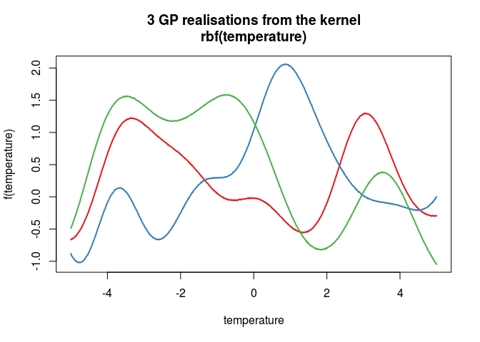
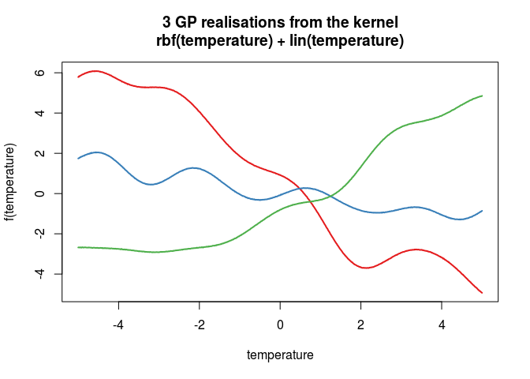

<!-- README.md is generated from README.Rmd. Please edit that file -->
[](https://travis-ci.org/goldingn/gpe)  [](https://codecov.io/github/goldingn/gpe?branch=master)

Gaussian process everything
===========================

gpe is an R package implementing a Gaussian process (GP) statistical modelling framework. The aims of the project are to provide *some* of the functionality of fully featured GP toolboxes available in other languages, such as [GPy](https://github.com/SheffieldML/GPy) for python and [GPstuff](http://becs.aalto.fi/en/research/bayes/gpstuff/) for MATLAB. Mostly though it's about communicating the power of the GP approach to an applied statistical audience.

Why?
----

Latent Gaussian process models constructed using compositional kernels - that is kernels created by adding, multiplying and convolving a series of basis kernels - can take a vast array of different functional forms, including many widely used statistical models as special cases. These include generalised linear (mixed, fixed or random) models; generalised additive models; geostatistical models and multivariate response models including the joint species distribution models which are starting to be used in ecology. Under a GP approach, components of each of these models can be mixed and matched and extended in weird and wonderful directions.

The aim of the package (and a planned accompanying demonstration repo) is to demonstrate how these models are all related and stimulate research into what can be done with the GP framework in an applied setting. It's certainly hoped that the package will developed into a fully-featured toolbox for all your GP needs, but that's a long way off for now. In the mean time you'd be better off using one of the existing packages mentioned above, or one of the many other packages that I haven't mentioned.

Installation
------------

You can install and load this package directly from github using the wonderful devtools package as follows:

``` r
library(devtools)
# install_github('goldingn/gpe')
library(gpe)
#> 
#> Attaching package: 'gpe'
#> The following object is masked from 'package:base':
#> 
#>     %x%
```

Progress
--------

### Kernels

There are a small handful of basis kernels currently implemented. These are easy to construct and visualise, like this:

``` r
# Create an rbf kernel which acts on some variable named temperature
k1 <- rbf('temperature')
# look at the parameters
summary(k1)
#> 
#> Kernel summary
#> 
#>              type:  rbf
#>              active columns:  temperature
#>              parameters: sigma  =  1 
#>                                                              l  =  1 
#>                                                              
# plot covariance
plot(k1)
```


``` r
# look at some GPs drawn from this kernel
demoKernel(k1)
#> Warning in jitchol(K): A Cholesky factorisation could not initially be
#> computed, so 1e-05 was added to the diagonal.
```



Crucially though, these kernels may be combined to create new functional forms:

``` r
# create a linear kernel
k2 <- lin('temperature')
# change a parameter
k2 <- setParameters(k2, sigma = 0.5)
# plot draws from it
demoKernel(k2)
#> Warning in jitchol(K): A Cholesky factorisation could not initially be
#> computed, so 2.087504e-05 was added to the diagonal.
```


``` r
# a GP model with a linear kernel is the same as (Bayesian) linear regression

# add the two together
k3 <- k1 + k2
# and visualise them
demoKernel(k3)
#> Warning in jitchol(K): A Cholesky factorisation could not initially be
#> computed, so 3.087504e-05 was added to the diagonal.
```



``` r
# this is the same as adding the random draws together

# multiply this by a periodic kernel
k4 <- k3 * per('temperature')
# visualise this one
plot(k4)
```


``` r
demoKernel(k4)
#> Warning in jitchol(K): A Cholesky factorisation could not initially be
#> computed, so 3.087504e-05 was added to the diagonal.
```


``` r

# and you can go on and on, combining kernels infinitely!
```

### GPs

There is now an interface for fitting GP models to Gaussian and some non-Gaussian (Poisson and Bernoulli at the moment) data and making predictions from them:

``` r
# make a fake 'true' function
f <- function(x) 2 * sin(x)

# make a fake dataset
x <- sort(runif(100, -2, 2))
y <- rpois(100, exp(f(x)))
df <- data.frame(y, x)

# fit a Poisson GP model with an rbf kernel
m <- gp(y ~ rbf('x'), data = df, family = poisson)

# predict from it
pred_df <- data.frame(x = seq(min(df$x), max(df$x), len = 500))
lambda <- predict(m, pred_df, type = 'response')

# plot the predicted rate parameter, the true model and the data
plot(lambda ~ pred_df$x, type = 'l', lwd = 2, ylim = range(y))
lines(exp(f(pred_df$x)) ~ pred_df$x, lty = 2)
points(y ~ x, data = df)
```


``` r

# note you can get the posterior variance (prediction uncertainty) too,
# just set 'sd = TRUE' when predicting
```

You can now do inference on the model hyperparameters (the parameters of the kernel), though note that this is often tricky for GP models. Nice glm-style summaries of the fitted models is in the pipeline too, but not yet implemented.

License
-------

The package is distributed under the MIT license, which I think means you can do pretty much anything with it as long as you keep my name on the code and don't sue me, but see the LICENSE file for details
